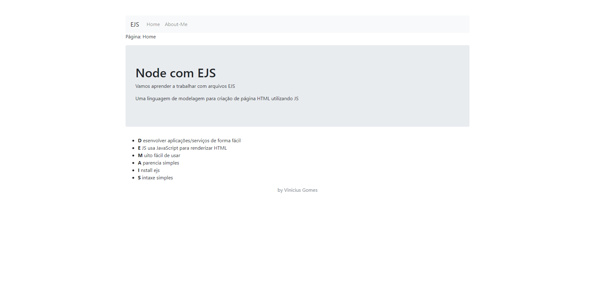

# First Project | Node.js with EJS



```
This project was made when I had the first contact with Node.js, 
I didn't get to delve too deep into Node.js, ejs was the 
highlight in this project, because the objective was to create 
a simple page using Node.js with some tabs, without having to 
enter another page and load other content.

```

<br><br>

## 4 Steps to use it.

1. Install

```sh
    git clone https://github.com/ViniciusGomes2006/ViniciusGomes2006.git
```

2. Build

```sh
    npm install
```

3. Run
```
    node script.js
```

4. Open in your browser
```
http://localhost:8080/
```

---

If this project helps you, please leave your star 🌟 Thank you 💛